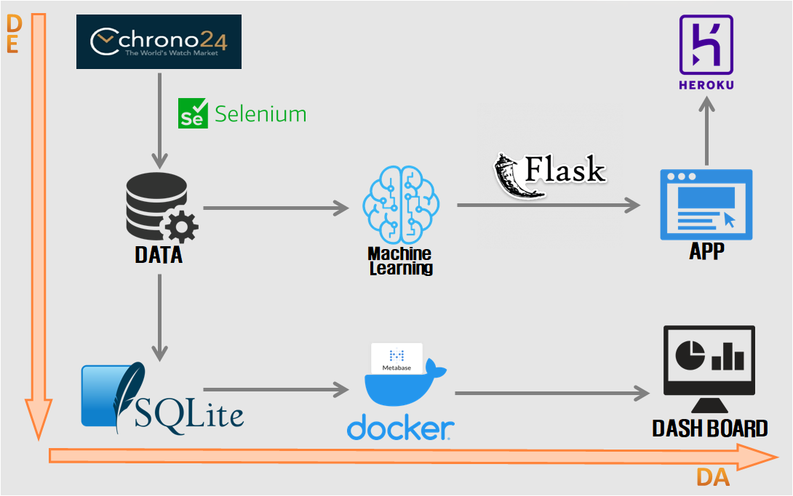
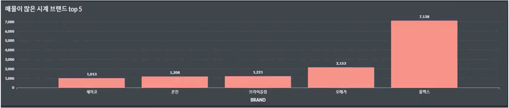

## **Watches What** 
## **(Watch price prediction web app)**
https://watcheswhat.herokuapp.com/
 

#### 파일 설명
    flask_app : web app 제작에 쓰인 flask코드
    images : readme 첨부 사진모음
    modeling_pkling : 가격예측모델 개발 및 피클링
    pipeline : 데이터 적재를 위해 동적스크레이핑  
    　　　　　　(selenium)을 구현한 코드
    Procfile : 개발한 web app을 heroku로 배포하기 위한 코드
    requirements : 작업에 사용된 라이브러리 버전 모음
    watch_raw_db : 동적스크레이핑을 통해 적재한 DB
 

### **사용한 데이터**
https://www.chrono24.kr/ 
명품 중고시계 거래 플랫폼 chrono24의 데이터를 크롤링하여 watch_raw_db파일로 적재
  
Data preview

 
 

### **프로젝트 목적**
chrono24 플랫폼의 데이터를 기반으로 시계 브랜드, 작동방식, 유리성질, 보증품여부에 따라 중고시계 가격을 예측하여 구매·판매 이전 대략적인 가격대를 확인할 수 있는 웹 앱 개발
  

###

### **프로젝트 진행 방향** 
**1. 파이프라인 소개** 

**2. 어플리케이션 시연 **
　- 2.1 Home화면 
　- 2.2 예측 옵션 
　- 2.3 예측 결과 
　- 2.4 Web APP 시연영상 

**3. 대시보드 분석 **
　- 3.1 플랫폼 매물 수 
　- 3.2 매물 옵션 비중 
　- 3.3 최소, 평균, 최대 가격 매물 

**4. 결론 **

**5. 한계점 및 해결 방안 **
 

### **1. 파이프라인 소개 **
> 크게 Data Engineering, Data Analysis의 성질로 분류하여 진행

 
**Data Engineering**  
　- Chrono24 플랫폼의 데이터를 Selenium으로 크롤링하여 
　　확보된 Data 적재 
　- 데이터 자동 수집 실행 화면

 
 
**Data Analysis**  
　- DB를 활용하여 가격을 예측하는 머신러닝 모델 　　(linear regression) 개발 및 web app에 장착 후 배포
 
　- DB를 활용하여 docker환경의 Metabase로 플랫폼 분석 
 

 

### **2. 어플리케이션 시연 **

 

#### **2.1　Home 화면**
> 주제를 환기시킬 수 있는 포스터를 배치하고, 가격예측에 필요한 옵션들을 선택할 수 있는 환경 구성

 

 

#### **2.2　예측 옵션**
> 중고가 산정에 영향을 미치는 옵션 4가지의 세부 항목

 

 

#### **2.3　예측 결과**
> 선택항목을 상기시켜주며, 예측가를 출력 
다시해보기 버튼으로 홈화면 복귀

 

 

#### **2.4　Web APP 시연영상**
>옵션선택 > 가격확인 > 홈 화면 복귀

 

 

### **3. 대시보드 분석 **

 

#### **3.1　플랫폼 매물 수**
> 매물이 많은 브랜드 top5 / 매물이 적은 브랜드 top5 / 가격대별 매물 분포 확인  

롤렉스 브랜드 시계의 중고매물 등록이 가장 많이 되어 있음.  

미도 브랜드 시계의 중고매물 등록이 가장 적었음.  

1,000만원~5,000만원대의 매물이 전체 분포의 50%를 차지
 

 

#### **3.2 매물 옵션 비중**
> 명품시계이다 보니 보증품 관리가 철저하며, 
대다수가 품질면에서 우수한 사파이어 글라스를 채택

 

 

#### **3.3 최소, 평균, 최대 가격 매물**
> 
 

 

### **4. 결론 **
> 명품 중고시계 플랫폼에서 확보한 데이터 특성상,  
등록된 매물은 고가 또는 희소성이라는 상품가치를 우선시.  
전체적으로 높은 가격대를 형성하고 있기 때문에 
**등록된 물품에 대한 구성품(보증서) 보유율이 높았으며,** 
**품질면에서 우수한 사파이어 글라스 채택률이 높았다.**  
시계가 고가에 거래되는 이유인 Movement에서 건전지로 작동하는 쿼츠 보다, **시계사의 기술과 철학이 들어간 오토매틱 비중이 높은 것**을 확인 할 수 있다.  
따라서 가격 예측시 브랜드를 제외했을때, **모든 구성품을 보유중이고,** **오토매틱 작동방식이며,** **사파이어글라스를 채택한 제품**이 **가장 높은 가격대를 형성**한다.
 

 

### **5. 한계점 및 해결 방안 **
> **1. 시계 모델에 대한 정보가 없어 상세한 가격예측이 불가능**  
같은 브랜드 제품이더라도, 모델명, 모델 버전, 색상 등에 따라 소비자가의 차이가 크기 때문에, 
**데이터 파이프라인이 상세한 정보를 확보 할 수 있도록 설계** 
해야 한다.  

> **2. 예측 모델의 출력값이 일반적이지 않음**  

고가의 시계들이 즐비한 데이터 이기에, 예측값에서 **상향평준화**가 일어남을 볼 수 있었으며, 
반대로, 가격이 감소되는 옵션을 선택 시 예측가격이 **음수의 영역**까지 나오는 것을 볼 수 있었다.  
1번 한계점을 해결한 데이터를 확보하여 
**디테일한 특성이 학습된 머신러닝 모델을 탑재** 하거나, 
**옵션마다 가중치를 다르게 부여** 하여 보다 일반적인 가격대가 출력되도록 한다.